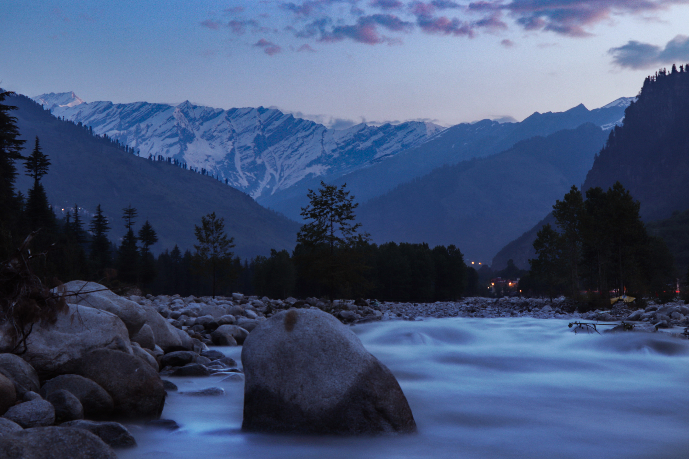

Hi there, I am Monika Rangta. I am currently pursuing my Master's in Security and Cloud Computing from Aalto University, Finland. 

Basically, I am from India and moved to Finland in 2018. I am from North India, Himachal, which is in the western Himalayas. I live in the lap of mountains and difficult terrains :)

Well, Finland is also treating me good. It is rich in nature and has beautiful landscapes. 

Currently, I am working as a teaching assistant for Information Security course. I choose computer science as my major because we are using it in everyday life in countless ways and it's important to use the technologies in a secure way, that's why I choose Security and Cloud Computing as my main.

